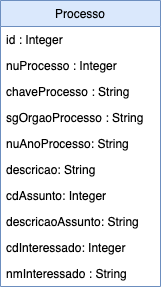

## Projeto de Aplicação módulo 2 

### Descrição

Você está participando de um processo seletivo para ingressar numa vaga de programador em uma grande empresa de TI. Uma das etapas do processo envolve a criação de uma **API RESTFULL**, para a realização de consultas, cadastros e atualizações de processos online. Para tal o usuário precisará realizar uma consulta de processos e visualizar o resultado contendo o detalhamento do processo e também oferencendo a opção de edição de informarções e exclusão do mesmo. Telas do sistema online para conhecimento pode ser vista [AQUI](https://www.figma.com/proto/BTa9Vpz4S1XUscURxANvFH5Z/DESAFIO?node-id=19%3A70&scaling=scale-down&redirected=1).

### Funcionalidades

* 1 - Deverá haver um endpoint para criação de um processo;
* 2 - Deverá haver um endpoint para listagem de todos os processos, retornando todos os atributos de cada  processo;
* 3 - Deverá haver um endpoint para buscar um processo baseado na sua identificação única (id);
* 4 - Deverá haver um endpoint para buscar um processo baseado no seu número de processo (chaveProcesso);
* 5 - Deverá haver um endpoint para atualização de todos os atributos de um processo baseado na sua identificação única (id);
* 6 - Deverá haver um endpoint para exclusão de um processo baseado na sua identificação única (id);     

### Regras de Negócio 

* Não poderá ser cadastrado um novo processo com um id já existente.

### Requisitos

* Spring Boot na estrutura de projeto no backend;
  * Uso de versionamento de API;
  * Uso dos métodos (verbos) HTTP;
  * Uso do padrão de projeto MVC;
  * Uso dos respectivos status codes equivalente a cada requisição HTTP;
  * O media type de arquivo ultilizado no projeto deve ser o : "application/json";

### Considerações

Considere em utilizar a seguinte classe abaixo para simular uma consulta de todos os processos em um banco de dados:

```java
@Component
public class ProcessoMock implements Serializable {

	private static final long serialVersionUID = 1838934594260766206L;

  public List<ProcessoDTO> getAllProcessos() {
    List<ProcessoDTO> listProcessos = new ArrayList<ProcessoDTO>();
    int qtdProcessos = 40;
    for (int i = 0; i < qtdProcessos; i++) {
      ProcessoDTO dto = new ProcessoDTO();
      dto.setId(i+1);
      dto.setCdAssunto(i+1);
      dto.setCdInteressado(i+1);
      dto.setDescricao("Processo " + (i + 1 ) + "de testes DEV In House ");
      dto.setDescricaoAssunto("Assunto " + (i + 1 ) + " de testes DEV In House ");
      dto.setNmInteressado("Jão Antonio ::: " + i);
      dto.setNuAnoProcesso(i <=20 ? "2020" : "2021");
      dto.setNuProcesso(i+1);
      dto.setSgOrgaoProcesso("SOFT");
      dto.setChaveProcesso(dto.getSgOrgaoProcesso() + " " + dto.getNuProcesso() + "/" + dto.getNuAnoProcesso());
      listProcessos.add(dto);
    }
    return listProcessos;
  }
}
```

### Modelo de classe




 ### Instruções para a avaliação

- **Fork** esse [repositório](https://github.com/jeffersonoh/devinhouse-avaliacao-modulo-2) e faça o desafio numa branch com o seu nome (exemplo: nome-sobrenome)
- Assim que concluir o seu desafio, abra um **pull request** com suas alterações

