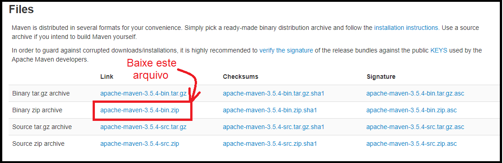
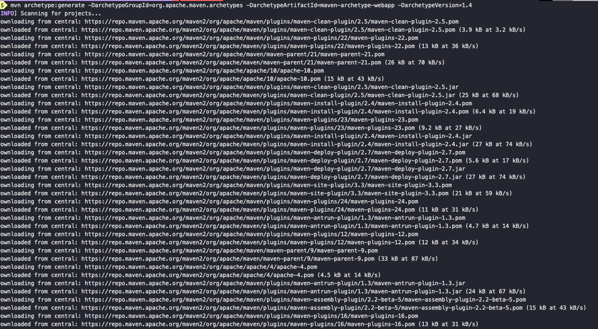
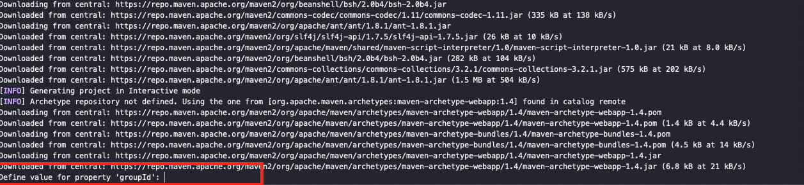
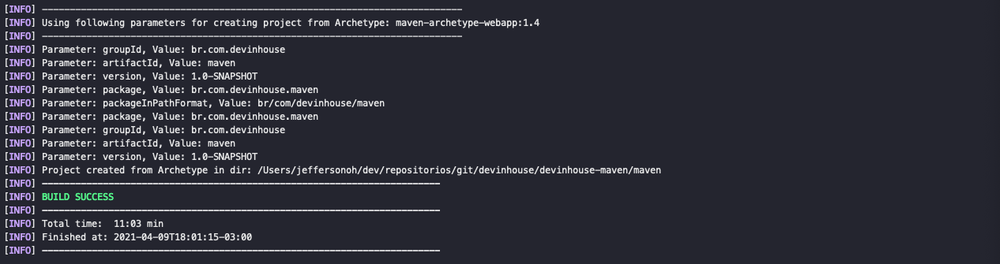
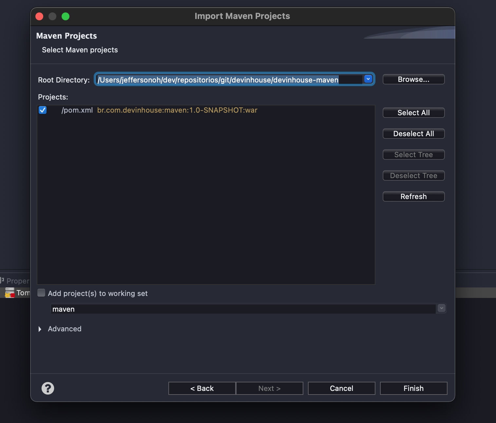
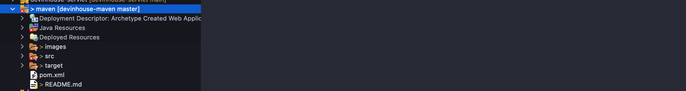

# Show me the code !!!


Este guia fornece uma amostra rápida de como iniciar uma aplicação no Maven. Vamos ver aqui um guia rápido de como criar uma aplicação nesta estrutura. Para um aprofundamento sobre o Maven recomendo uma leitura na sua documentação oficial ;), lá tem muito material e exemplos de códigos para cada cenário específico .

[Documentação Oficial AQUI](https://maven.apache.org/)

## 1. Instando o Maven

O **maven** é um dos principais gerenciadores de dependências conhecidos para Java. Mas este nome pode assustar um pouco os iniciantes no desenvolvimento Java e a primeira dúvida que surge para começar a usá-lo é **como eu instalo o maven**.

Como não tem um "instalador" normal pra você executar e ir clicando em "Próximo", a instalação do maven pode gerar um pouco de confusão, mas é bem simples.

### 1.1 Pré-requisito (JDK)

O principal requisito para instalar e usar o **maven** na sua máquina é ter previamente instalado o JDK (Java Development Kit) 1.7 ou superior.

Também é necessário configurar a variável de ambiente `JAVA_HOME` no seu computador. 

Por agora tenha certeza que você tenha instalado o JDK 1.7 ou superior.

### 1.2 Download do maven

O próximo passo é baixar o maven compactado em sua versão mais atual. Você precisa baixar o arquivo com os binários do maven, não é necessário baixar o arquivos-fonte. Ou seja, você vai baixar o arquivo que termina com `-bin` e não o arquivo que termina com `-src`.

Para baixar o maven, basta [clicar aqui](https://maven.apache.org/download.cgi) e fazer o download. Você pode escolher qualquer formato de compactação para download, mas eu sugiro o arquivo `-bin.zip`, por ser o formato de compactação mais comum.

Veja um exemplo da página de download do maven.



Após o download descompacte o arquivo em algum diretorio do seu computador.

### 1.3 Configurando as variáveis de ambiente

Para fazer o maven funcionar você só precisa adicionar a pasta `bin` do maven na variável de ambiente `PATH`.

Se você nunca configurou uma variável de ambiente no Windows basta seguir esses passos.

#### Windows

- Verifique o valor da variável de ambiente, por exemplo

```tex
1. echo %JAVA_HOME% 
2. C:\Program Files\Java\jdk1.7.0_51
```

- Adicionando a `PATH`: Adicione o diretório bin da distribuição descompactada à variável de ambiente PATH do usuário abrindo as propriedades do sistema (WinKey + Pause), selecionando a guia "Avançado" e o botão "Variáveis de ambiente" e, em seguida, adicionando ou selecionando a variável *PATH* em as variáveis do usuário com o valor `C:\Program Files\apache-maven-3.8.1\bin`. A mesma caixa de diálogo pode ser usada para definir `JAVA_HOME`a localização do seu JDK, por exemplo`C:\Program Files\Java\jdk1.7.0_51`
- Abra um novo prompt de comando (Winkey + R e digite `cmd`) e execute `mvn -v`para verificar a instalação.

#### Sistema operacional baseado em Unix (Linux, Solaris e Mac OS X)

- Verifique o valor da variável de ambiente

```tex
1. echo $JAVA_HOME
2. /Library/Java/JavaVirtualMachines/jdk1.8.0_45.jdk/Contents/Home

```

- Adicionando a `PATH`

```tex
1. export PATH=/opt/apache-maven-3.8.1/bin:$PATH
```

Confirme se a instalação foi feita com sucesso 

```tex
mvn -v
```

```tex
Apache Maven 3.8.1 (0ec48eb515d93f8515d4abe465570dfded6fa13a3ceb9aab8031428442d9912ec20f066b2afbf56964ffe1ceb56f80321b50db73cf77a0e2445ad0211fb8e38d)
Maven home: /opt/apache-maven-3.8.1
Java version: 1.8.0_45, vendor: Oracle Corporation
Java home: /Library/Java/JavaVirtualMachines/jdk1.8.0_45.jdk/Contents/Home/jre
Default locale: en_US, platform encoding: UTF-8
OS name: "mac os x", version: "10.8.5", arch: "x86_64", family: "mac"
```

Para que usa a distribuição baseado em Debian para simplificar pode realizar a instalação via gerenciador de pacote digitando o seguinte comando no terminal

```shell
sudo apt-get update

```

Depois, você consegue instalar o Maven com o comando:

```shell
sudo apt-get -y install maven

```


## 2. Criando nosso projeto Maven 


Além de ser um genrenciador de dependencia o maven possui "esqueletos" de projetos que ajudam no start do nosso projeto.

Esses esqueletos são os chamados Archetype. Um Archetype é definido como *um padrão ou modelo original do qual todas as outras coisas do mesmo tipo são feitas* . Os nomes se encaixam, pois estamos tentando fornecer um sistema que forneça um meio consistente de gerar projetos Maven. O Archetype ajudará os autores a criar modelos de projeto Maven para usuários e fornecerá aos usuários os meios para gerar versões parametrizadas desses modelos de projeto.  

Existem diversos modelos de Archetype vamos utilizar aqui o modelo "Webapp Archetype" para mais informações link da documentação [AQUI](https://maven.apache.org/archetypes/maven-archetype-webapp/)

Pelo terminal vamos digitar o seguinte comando:

```shell
mvn archetype:generate -DarchetypeGroupId=org.apache.maven.archetypes -DarchetypeArtifactId=maven-archetype-webapp -DarchetypeVersion=1.4
```


Será feito o download de todas as dependências necessárias para o nosso projeto conforme imagem abaixo:



Vai ser solicitado algumas informações para a criação do nosso projeto:



No **groupId** colocaremos "br.com.devinhouse" no campo **artfactId** colocaremos "maven"  o proximo passo  **version** apertamos a tecla enter para deixar com versão sugerida "1.0-SNAPSHOT", no campo **package** colocamos o seguinte valor "br.com.devinhouse.maven" . Pronto agora é só conferir as informações digitadas e confirmar com a tecla **Y** .




### 2.1 Importando o projeto na sua IDE(eclipse)

Com o projeto criado, na sua IDE com o botao direito do mouse vamos seguir os passos abaixo :

```tex
Import -> Import -> Maven -> Existing Maven Projects -> Next 
```

No próximo passo selecione o projeto criado anteriormente:



Clique em "Finish"

Pronto nosso projeto já está importado em sua IDE:

