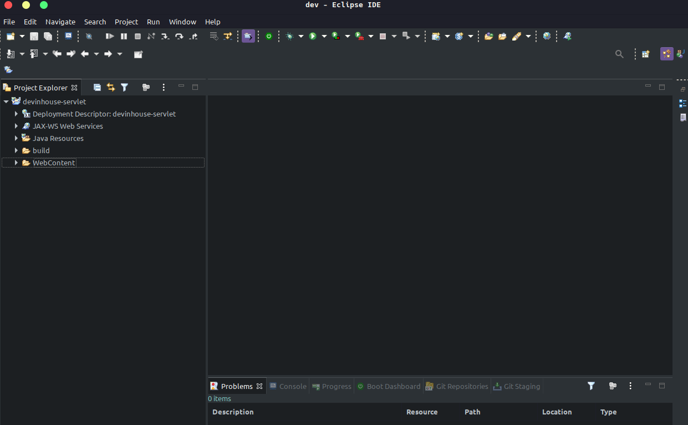

# Show me the code !!!

O comportamento dos servlets que vamos ver foi definido na classe `HttpServlet` do pacote `jakarta.servlet.*`.

A interface `Servlet` é a que define exatamente como uma servlet funciona, mas não é o que vamos utilizar, uma vez que ela possibilita o uso de qualquer protocolo baseado em requisições e respostas, e não especificamente o HTTP.

Para escrevermos um servlet, criamos uma classe Java que estenda `HttpServlet` e sobrescreva um método chamado `service`. Esse método será o responsável por atender requisições e gerar as respostas adequadas. Sua assinatura:

```java
 protected void service (HttpServletRequest request,HttpServletResponse response)
          throws ServletException, IOException {
      ...
  }
```

Repare que o método recebe dois objetos que representam, respectivamente, a requisição feita pelo usuário e a resposta que será exibida no final. Veremos que podemos usar esses objetos para obter informações sobre a requisição e para construir a resposta final para o usuário.

Nosso primeiro exemplo de implementação do método `service` não executa nada de lógica e apenas mostra uma mensagem estática de bem vindo para o usuário. Para isso, precisamos construir a resposta que a servlet enviará para o cliente.

É possível obter um objeto que represente a saída a ser enviada ao usuário através do método `getWriter` da variável `response`. E, a partir disso, utilizar um `PrintWriter` para imprimir algo na resposta do cliente:

```java
public class HelloWord extends HttpServlet {
    
      protected void service (HttpServletRequest request,HttpServletResponse response)
              throws ServletException, IOException {

          PrintWriter out = response.getWriter();

          // escreve o texto
          out.println("<html>");
          out.println("<body>");
          out.println(" Hello word ");
          out.println("</body>");
          out.println("</html>");
      }
  }
```

O único objetivo da servlet acima é exibir uma mensagem HTML simples para os usuários que a requisitarem. Mas note como seria muito fácil escrever outros códigos Java mais poderosos para gerar as Strings do HTML baseadas em informações dinâmicas vindas, por exemplo, de um banco de dados.

## Criando nosso projeto

Primeiramente vamos abrir nossa IDE e seguir os seguintes passos :

```
File -> New -> Dynamic Web Project
```

Preencha o campo Project name com o nome do nosso projeto e cliqui em finalizar.


Teremos a seguinte estrutura abaixo:



Agora vamos criar nossa classe servlet selecionando a pasta **src** 


Com o botao direito do mouse vamos seguir os passos  abaixo :

```
New -> Class
```


No campo "Package" vamos inserir o seguinte valor 

```
br.com.devinhouse.servlet
```

No campo "Name" vamos inserir o seguinte valor

```
HelloWord
```


Finalizar

Vamos ter o seguinte resultado


Vamos agora na classe "HelloWord" extender a classe **HttpServlet**


Perceba que a partir de agora está aparendo um erro de compilação na classe "HelloWord" devido a não possuimos a lib jakarta.servlet-api adicionada como dependencia de nosso projeto. 

Podemos fazer o dowload da dependencia em clicando [aqui]( https://jar-download.com/artifacts/jakarta.servlet/jakarta.servlet-api/5.0.0-M2/source-code[)


Após o download basta extrair o conteudo do arquivo e adicionar o arquivo **jakarta.servlet-api-5.0.0.jar** para dentro da pasta :

```
WebContent -> WEB-INF -> lib 
```

Clique em "OK" na tela que irá aparecer após realizar esse processo


Após a inclusão da depencia podemos realizar o import do pacote **jakarta.servlet**  pela combinação de teclas

```
Shift + Ctlr + o
```

Agora  neste momento os erros de compilação já não existem mais 


Agora vamos sobreescrever o método *service* da classe **HttpServlet**  e implementar o nosso html de retorno.


Agora precisamos criar nossas rotas de acesso e para isso precisamos criar o arquivo `web.xml`, que fica dentro da pasta `WEB-INF`.


Agora no aquivo **web.xml** vamos inserir o seguinte conteudo 


```xml
<web-app xmlns="http://xmlns.jcp.org/xml/ns/javaee"
	xmlns:xsi="http://www.w3.org/2001/XMLSchema-instance"
	xsi:schemaLocation="http://xmlns.jcp.org/xml/ns/javaee
         http://xmlns.jcp.org/xml/ns/javaee/web-app_3_1.xsd"
	version="3.1">

	<servlet>
		<servlet-name>primeiraServlet</servlet-name>
		<servlet-class>br.com.devinhouse.servlet.HelloWord</servlet-class>
	</servlet>

	<servlet-mapping>
		<servlet-name>primeiraServlet</servlet-name>
		<url-pattern>/hello</url-pattern>
	</servlet-mapping>
</web-app>
```

Uma vez que chamar o servlet pelo pacote e nome da classe acabaria criando URLs estranhas e complexas, é comum mapear, por exemplo, um servlet como no exemplo, chamada HelloWord para o nome `primeiraServlet`.

Começamos com a definição da servlet em si, dentro da tag `<servlet>`:

```xml
<servlet>
    <servlet-name>primeiraServlet</servlet-name>
    <servlet-class>br.com.devinhouse.servlet.HelloWord</servlet-class>Repare que não criamos diretório nenhum na nossa aplicação (exceto o pacote para a nossa classe Servlet). Ou seja, o mapeamento da servlet não tem relação alguma com um diretório físico na aplicação. Esse mapeamento é apenas um nome atribuído, virtual, que é utilizado para acessarmos a aplicação.
  </servlet>
```

Em seguida, mapeamos nossa servlet para a URL `/hello`. Perceba que isso acontece dentro da tag `<servlet-mapping>` (mapeamento de servlets) e que você tem que indicar que está falando daquela servlet que definimos logo acima: passamos o mesmo `servlet-name` para o mapeamento.

```xml
 <servlet-mapping>
    <servlet-name>primeiraServlet</servlet-name>
    <url-pattern>/hello</url-pattern>
  </servlet-mapping>
```

Portanto, são necessários dois passos para mapear uma servlet para uma URL:

- Definir o nome e classe da servlet;
- Usando o nome da servlet, definir a URL.

Agora já temos nosso servlet mapeado e pronto para fazer Deploy.

## Instalando o Tomcat no eclipse

Agora que nossa aplicação já está pronta para realizar o deploy precisamos instalar o nosso Web container aqui utilizaremos o Tomcat para essa função.

Precisamos realizar o download em  https://tomcat.apache.org/download-10.cgi  e extrair o arquivo compactado para alguma pasta em nosso computador.

No eclipse vamos em :

```
WIndow -> Show View -> Servers
```

Agora vamos clicar no link *No servers are available ......* e vamos adicionar um novo server.

```
Apache -> Tomcat v10.0 Server -> Finish
```


Selecione a raiz do projeto e clique com o botão direito do mouse e escolha a opção

```
Debug As -> 1 Debug on Server 
```

Agora nossa aplicação vai estar rodando de modo debug dentro do Tomcat 


Podemos acessá-la pela url : http://localhost:8080/devinhouse-servlet/hello


 