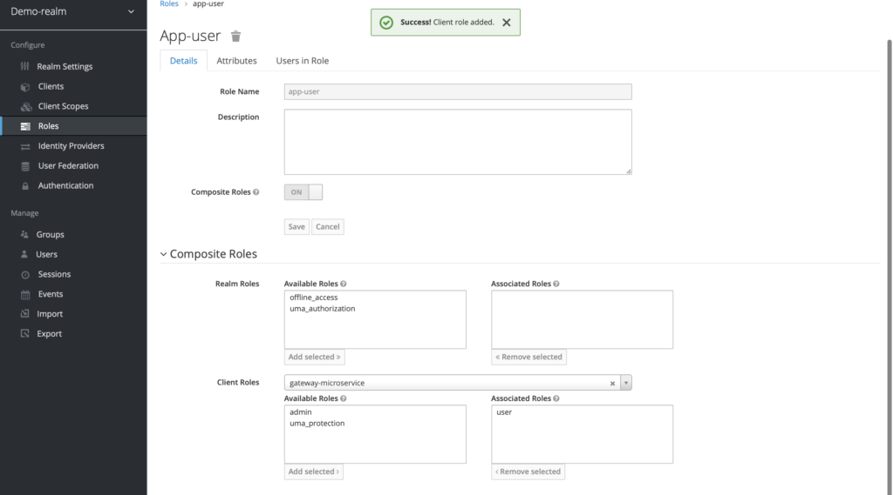
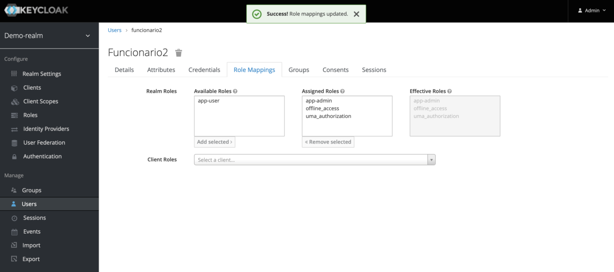

# Segurança de Aplicações com Keycloak


Quando pensamos em segurança de aplicações hoje no mercado existem diversas alternativas que em algumas delas os conceitos de autorização e autenticação se confundem.

Alguns protocolos conhecidos tais como **OAuth**,**Open ID** e **SAML** são certamente comentados nesses tópicos. 

Neste artigo não vou explorar em detalhas o funcionamento de cada um (*isso é tema para outros artigos ;)* ) mas vamos criar uma aplicação tradicional em Java,  sendo esta camada de autorização/autenticação  gerenciada por uma aplicação bastante famosa hoje no mercado chama de **Keycloak** que abstrai bastante desses conceitos.


## Keycloak o que é ?

[Keycloak](https://www.keycloak.org/) é uma ferramenta de gerenciamento de acesso e identidade **IAM (Identity and Access Management)** de código aberto [aqui está o seu repositório](https://github.com/keycloak/keycloak) com foco em ferramentas modernas tais como **single-page applications (SPA)**, aplicativos móveis e APIs REST.

O projeto foi iniciado em 2014 com um forte foco em tornar mais fácil para os desenvolvedores proteger seus aplicativos. Hoje o projeto tem como *sponsored* a **RedHat** e desde então, cresceu e se tornou um projeto de código aberto bem estabelecido com uma forte comunidade e base de usuários. É usado na produção para cenários que variam de pequenos sites com numero reduzido de usuários até grandes empresas com milhões de usuários.

Keycloak fornece páginas de login totalmente personalizáveis, incluindo autenticação forte, também com vários fluxos, como  recuperação de senhas, exigindo que os usuários atualizem regularmente suas senhas, aceitação de termos/ condições e muito mais. 

Todas as páginas visíveis para seus usuários suportam temas personalizados, tornando muito fácil modificar a aparência das páginas para integrar-se à sua marca corporativa e aos aplicativos existentes.

Ao delegar autenticação ao Keycloak, seus aplicativos não precisam se preocupar com
diferentes mecanismos de autenticação ou como armazenar senhas com segurança. Esta abordagem também fornece um nível mais alto de segurança, pois os aplicativos não têm acesso direto ao usuário e credenciais, eles recebem, em vez disso, tokens de segurança que lhes dão apenas acesso para o que eles precisam.

O Keycloak fornece login único, bem como recursos de gerenciamento de sessão, permitindo que os usuários acessem vários aplicativos, tendo apenas que se autenticar uma vez. Todos os usuários e administradores têm total visibilidade de onde os usuários são autenticados e
pode encerrar sessões remotamente quando necessário.

Keycloak baseia-se em protocolos padrões da indústria com suporte para **OAuth 2.0**, **OpenID Connect**, e **SAML 2.0**. O uso de protocolos padrões da indústria é importante tanto do ponto de vista de segurança e perspectiva em termos de tornar mais fácil a integração com aplicativos já existentes com aplicativos  novos ou aplicativos de terceiros.

###  Configurando o Keycloak

A maneira mais rápida de dar o *start* no uso do Keycloak é através do docker basta seguir o guia abaixo em sua documentação oficial

 * [Run Docker](https://www.keycloak.org/getting-started/getting-started-docker)

#### Criando um realm

Com o projeto devidamento iniciado a primeira coisa que precisamos fazer é criar um novo realm no Keycloak.

Vou dar aqui uma breve explicação de como funciona esse conceito de **realms**. 

Um **realm** gerencia um conjunto de usuários, credenciais, funções e grupos. Um usuário que pertence a ele, e ele efetua login nesse realm. Realms são isolados uns dos outros e só podem gerenciar e autenticar os usuários que pertencem a ele. Dito isso, vamos ao próximo passo..

Vá para [http: //localhost:8080/auth/admin/](http: //localhost:8080/auth/admin/) e faça login no Keycloak Admin Console usando as credenciais de administrador (Geralmente são **admin:admin**).

No menu suspenso, clique em **Add realm**. Quando você está conectado ao **realm** **master**, este menu suspenso lista todos os realms existentes. Digite o nome de *demo-realm* no campo **Name** e clique em **Create**.


Quando o **realm** é criado, a página principal do console de administrador é aberta. Observe que o **realm** atual está agora definido como *demo-realm*. Alterne entre o gerenciamento do **realm** principal e o realm que acabamos de criar clicando nas entradas no menu suspenso **Select realm**. Verifique se **demo-realm** está selecionado para as configurações abaixo. Evite usar o **realm** **master**. Você não precisa criar o **realm** todas as vezes. É um processo único.

#### Criando um client

**Clients** são entidades que podem solicitar o Keycloak para autenticar um usuário. Na maioria das vezes, os **clients** são aplicativos e serviços que desejam usar o Keycloak para se proteger e fornecer uma solução de logon único. Os **clients** também podem ser entidades que desejam apenas solicitar informações de identidade ou um token de acesso, para que possam invocar com segurança outros serviços na rede protegidos pelo Keycloak.

Clique no menu **Clients** no painel esquerdo. Todos os **clients** disponíveis para o **realm** selecionado serão listados aqui.


Para criar um novo **client**, clique em **Create**. Você será solicitado a fornecer um **client ID**, um **Client Protocol** e uma **URL Root**. Uma boa opção para o **client ID** é o nome da sua aplicação (**gateway-microservice**), o **client protocol** deve ser definido como openid-connect e a **URL Root** deve ser definido como a URL da aplicação.


Após salvar, você irá para a tela de configuração do **client** onde é possível atribuir um nome e uma descrição ao **client**, se desejar. Deixe **Access Type** como **confidential**, **Authorization Enabled** para **On**, **Service Account Enabled** para **On** e clique em **Save**.


A aba **Credentials** mostrará o **client secret** necessário para as configurações do Keycloak com o **Spring Boot**.


Vá para a aba **Client Role** para criar as definições da **Role** do **gateway-microservice**. Imagine que a aplicação que você está construindo tem diferentes tipos de usuários e com permissões de usuário diferentes. Ex: *users e admins*. Ficaria mais ou menos assim:

* *Algumas APIs seriam acessíveis apenas aos users.*
* *Algumas APIs seriam acessíveis apenas para admins.*
* *Algumas APIs estariam acessíveis para users e admins.*

Conforme o exemplo, vamos criar duas **Roles**: *user* e *admin*, clicando no botão **Add Role**.


Adicionando uma nova Role


Adicionando a Role **user**


Adicionando a Role **admin**


#### Criando Realm Role

As aplicações geralmente atribuem acesso e permissões a funções específicas, em vez de usuários individuais, pois lidar com usuários pode ser muito difícil de gerenciar. Vamos criar *app-user e app-admin* **roles realm**, atribuindo as roles correspondente ao **gateway-microservice** (*user, admin*).

Clique no menu **Roles** no painel esquerdo. Todas as **roles** disponíveis para o **Realm** selecionado serão listadas.


Para criar o app-user **realm role**, clique em **Add role**. Você será solicitado a fornecer um nome da **role** e uma descrição. Forneça os detalhes como abaixo e salve.


Depois de Salvar, habilite o **Composite Role** e Procure o **gateway-microservice** no campo **Client roles**. Selecione a *user* **role** do **gateway-microservice** e clique em **Add Selected**.



Essa configuração atribuirá a *user* client role para o *app-user* **realm role** do *gateway-microservice*. Se você tiver vários **clients** com várias **roles**, escolha as **roles** necessárias de cada **client** para criar **realm role** com base na necessidade. Siga as mesmas etapas para criar o user *app-admin*, mas atribua a **client** **role** *admin* em vez da **role** *user*.

#### Criando usuários

Usuários são entidades capazes de efetuar login no seu sistema. Eles podem ter atributos associados a eles mesmos, como e-mail, nome de usuário, endereço, número de telefone e dia do nascimento. Eles podem ser associados ao grupo e ter **roles** específicas atribuídas a eles.

Vamos criar os seguintes usuários e conceder a eles funções de *app-user* e de *app-admin* para fins de teste.

* funcionario1 com *app-user* **realm** **role**.
* funcionario2 com *app-admin* **realm role**.
* funcionario3 com *app-user* e *app-admin* **realm roles**.

No menu, clique em **Users** para abrir a página da lista de usuários. No lado direito da lista de usuários vazia, clique em **Add user** para abrir a página de adicionar usuário. 

Digite um nome no campo **username**, este é o único campo obrigatório. Coloque a opção **Email Verified** de **Off** para **On** e clique em **save** para salvar os dados e abrir a página de gerenciamento para o novo usuário.


Clique na aba **Credentials** para definir uma senha temporária para o novo usuário. Digite uma nova senha e confirme-a. Mude o botão de **Temporary** de **On** para **Off** e clique em **Reset Password** para definir a senha do usuário para a nova que você especificou. Para simplificar, vamos definir a mesma senha para todos os usuários.


Clique na aba **Role Mappings** para atribuir o **realm roles** para o usuário. A lista de Realm roles estará disponível em **Available Roles**. Selecione uma **role** e clique em **Add Selected** para atribuir ao usuário.

Após a atribuição das **roles**, as **roles** atribuídas estarão disponíveis na lista **Assigned Roles**. Façam a mesma coisa para o usuários (funcionario2, funcionario3). Feito as atribuições as telas ficarão mais ou menos assim:


**funcionario1**



**funcionario2**


**funcionario3**

#### Geração dos tokens

Vá para **Realm Settings** do Demo-Realm no menu esquerdo e clique em **OpenID Endpoint Configuration** para ver os detalhes do endpoint.


**Configurações do realm**


Copie o **token_endpoint** do **OpenID Endpoint Configuration**. A URL deve ser mais ou menos assim:

#### Configuração Spring boot

Bom, chegou a melhor parte!! Suponho que já tenha levantado um projeto básico do Spring boot com as seguintes dependências: **Spring boot starter web** e **Spring boot starter security**.

Agora vamos adicionar a dependência do Keycloak no maven:

```
<dependency>
    <groupId>org.keycloak</groupId>
    <artifactId>keycloak-spring-boot-starter</artifactId>
	<version>13.0.1</version>	
</dependency>
```

Onde tem *keycloak.version* pode colocar a versão mais recente. Pode procurar no [repositório](https://search.maven.org/) do maven.

Depois adicionamos também o gerenciamento de dependências no maven para o Keycloak:

```
<dependencyManagement>
		<dependencies>
			<dependency>
				<groupId>org.keycloak.bom</groupId>
				<artifactId>keycloak-adapter-bom</artifactId>
				<version>13.0.1</version>
				<type>pom</type>
				<scope>import</scope>
			</dependency>
		</dependencies>
	</dependencyManagement>
```

No **application.properties** do **Spring boot** vamos adicionar a seguinte configuração:

```
#Keycloak Configuration
keycloak.auth-server-url=http://localhost:8080/auth
keycloak.realm=demo-app
keycloak.ssl-required=external
keycloak.resource=devinhouse-spring-boot-keycloak
keycloak.credentials.secret=733ff529-9bfd-4fd3-8d03-faf709b847a6
keycloak.use-resource-role-mappings=true
keycloak.bearer-only=true
```

O Keycloak fornece um **KeycloakWebSecurityConfigurerAdapter** como uma classe base conveniente para criar uma instância do **WebSecurityConfigurer**. 

A implementação permite a personalização substituindo métodos. Embora seu uso não seja necessário, ele simplifica bastante a configuração do contexto de segurança.

Vamos criar uma classe chamada **KeycloakSecurityConfig** que estende o adapter.

```
@Configuration
@EnableWebSecurity
@EnableGlobalMethodSecurity(jsr250Enabled = true)
class SecurityConfig extends KeycloakWebSecurityConfigurerAdapter {

	@Override
	protected void configure(HttpSecurity http) throws Exception {
		super.configure(http);
		http.authorizeRequests().anyRequest().permitAll();
		http.csrf().disable();
	}

	@Autowired
	public void configureGlobal(AuthenticationManagerBuilder auth) throws   Exception {
		KeycloakAuthenticationProvider keycloakAuthenticationProvider =   keycloakAuthenticationProvider();
		keycloakAuthenticationProvider.setGrantedAuthoritiesMapper(new SimpleAuthorityMapper());
		auth.authenticationProvider(keycloakAuthenticationProvider);
	}

	@Bean
	@Override
	protected SessionAuthenticationStrategy sessionAuthenticationStrategy() {
		return new RegisterSessionAuthenticationStrategy(new SessionRegistryImpl());
	}

	@Bean
	public KeycloakConfigResolver KeycloakConfigResolver() {
		return new KeycloakSpringBootConfigResolver();
	}

}
```

**configureGlobal**:  Registra o KeycloakAuthenticationProvider com o gerenciador de autenticação.

**sessionAuthenticationStrategy**: Define a estratégia de autenticação da sessão.

**KeycloakConfigResolver**: Por padrão, o Spring Security Adapter procura um arquivo de configuração keycloak.json. Você pode verificar se a configuração fornecida pelo Spring boot Adapter inclui este bean.

@**EnableGlobalMethodSecurity**: A propriedade *jsr250Enabled* nos permite usar a anotação

@**RoleAllowed**. Exploraremos mais sobre esta anotação daqui a pouco.


Vamos criar um **rest controller**:

```
@RestController
public class CustomUserAttrController {

    @RolesAllowed("user")
	@GetMapping(path = "/users")
	public ResponseEntity<String> getUser() {
        return ResponseEntity.ok("Hello User");
    }
    
    @RolesAllowed(admin")
    @GetMapping(path = "/admin")
        public ResponseEntity<String> getAdmin() {
            return ResponseEntity.ok("Hello Admin");
    }

    @RolesAllowed(all-use")
    @GetMapping(path = "/all-use")
        public ResponseEntity<String> getAllUser() {
            return ResponseEntity.ok("Hello All User");
    }
}
```

Pronto agora temos nossa aplicação segura gerenciada pelo **Keycloak** 


## Conclusão

Esse tópico de segurança de aplicações é super importante com bastante detalhes a serem considerados. Implementar uma aplicação que faça esse gerenciamento pode representar um problema devido a sua complexidade. Neste ponto o Keycloak cai como uma luva pois é uma aplicação de código aberto bastante madura com uma comunidade bastante ativa que facilita bastante a resolução de problemas mais complexos. 


### Referências

* [Documentação Oficial Keycloak](https://www.keycloak.org/documentation);
* [Medium - Securing Spring Boot REST APIs with Keycloak](https://medium.com/devops-dudes/securing-spring-boot-rest-apis-with-keycloak-1d760b2004e)
* [LIVRO - Keycloak - Identity and Access Management for Modern Applications](https://www.packtpub.com/product/keycloak-identity-and-access-management-for-modern-applications/9781800562493)