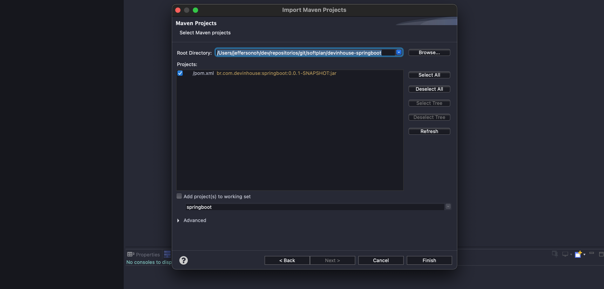
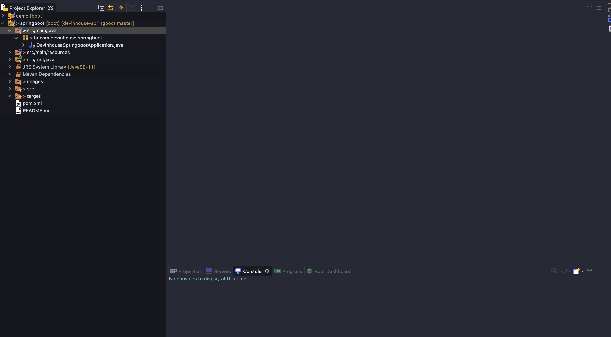
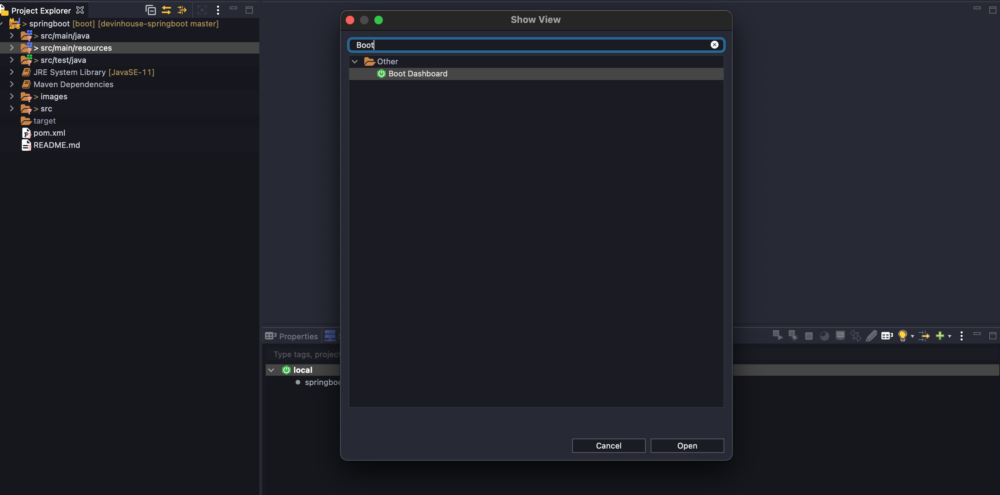
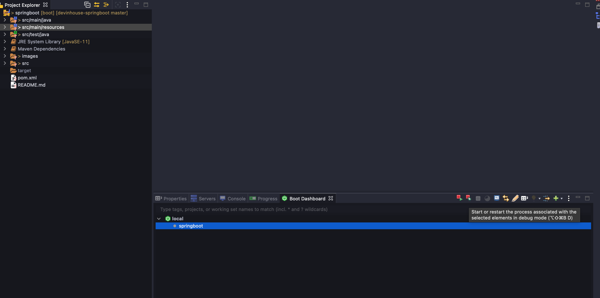
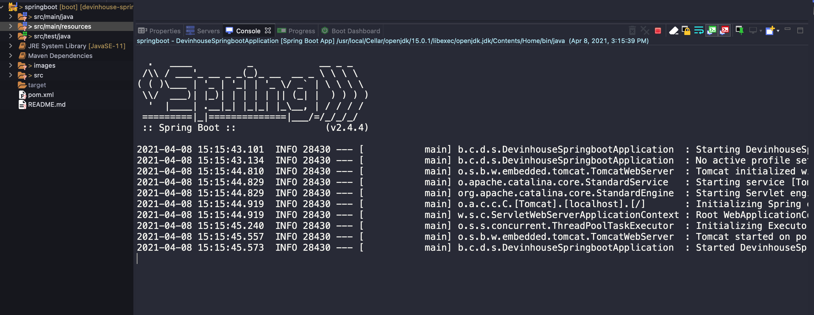
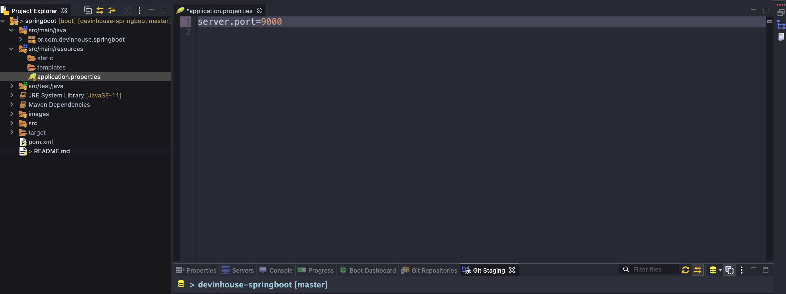
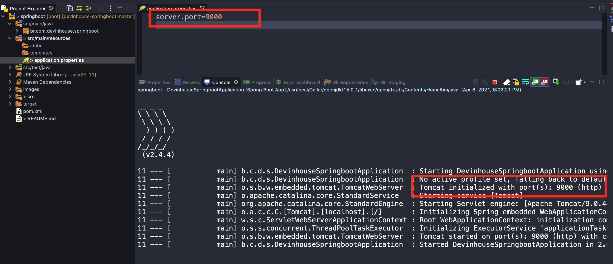
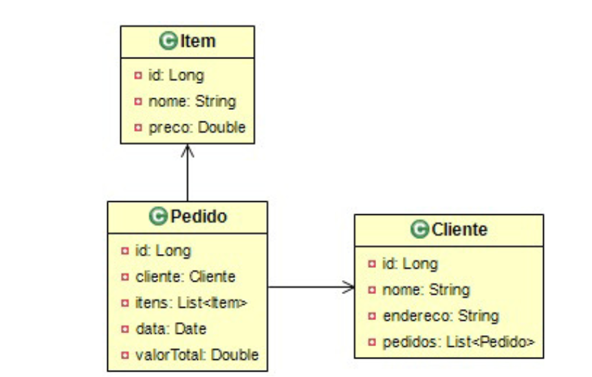
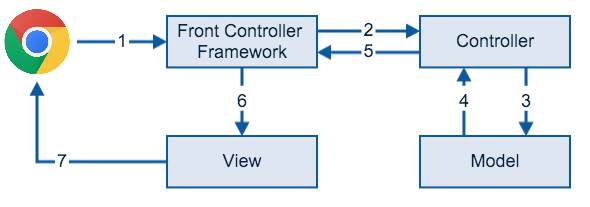

# Show me the code !!! 

Este guia fornece uma amostra  rápida de como iniciar uma aplicação no formato Spring Boot. Vamos ver aqui um guia rápido de como criar uma aplicação na estrutura do frameworh usando suas principais anotações. Para um aprofundamento sobre o framework recomendo uma leitura na sua documentação oficial ;), lá tem muito material e exemplos de códigos para cada cenário específico .

[Documentação Oficial AQUI](https://spring.io/projects/spring-boot) 

## 1. Criando seu projeto Spring Boot

Use [start.spring.io](start.spring.io) para criar um projeto “web”. Na caixa de diálogo “Dependências”, pesquise e adicione a dependência “web” conforme mostrado na captura de tela. Clique no botão “Gerar”, baixe o zip e descompacte-o em uma pasta em seu computador.


Os projetos criados por [start.spring.io](start.spring.io) contêm Spring Boot, uma estrutura que torna o Spring pronto para funcionar dentro do seu aplicativo, mas sem muito código ou configuração necessária. Spring Boot é a maneira mais rápida e popular de iniciar projetos Spring.

### 1.2 Importando o projeto na IDE (Eclipse) 

Para facilitar o uso de projetos no formato Spring Boot  em nosso IDE (Eclipse) precisamos instalar o plugin **Spring Tools 4 (aka Spring Tool Suite 4) 4.10.0.RELEASE** 

```text
Help -> Eclipse Markeplace -> Find -> Spring Tools 4 (aka Spring Tool Suite 4) 4.10.0.RELEASE 
```

Selecione e instale o plugin. Vai ser preciso reiniciar sua IDE.

Após a instalação do plugin agora vamos importar nosso projeto criado anteriormente.Com o botao direito do mouse vamos seguir os passos  abaixo :

```text
Import -> Import -> Maven -> Existing Maven Projects -> Next 
```

No próximo passo selecione o projeto criado anteriormente:



Clique em "Finish"

Pronto nosso projeto já está importado em sua IDE:



### 1.3 Execute o projeto

Precisamos adicionar a "view" do plugin Spring Tools 4 recem instalado, para isso vamos em :

```tex
Window -> Show View -> Other ... 
```

No campo de busca digite "Boot" e selecione a opção "Boot Dashboard"



Nosso projeto "springboot" irá aparecerer como opção de execução



Vamos executar a opção "Run os Debug"



### 1.4 Customizações

Até mesmo uma aplicação simples precisa de uma customização. No Spring Boot, existe o esquema de convenção sobre configuração. Ou seja, sem nenhum ajuste, a aplicação funciona com valores pré-definidos, e que, se você quiser, pode mudar via configuração.

A simplicidade do Spring Boot existe até em sua customização: ela pode ser feita via Java, ou via arquivo de **propriedades application.properties**. Nesse arquivo, existem centenas de configurações possíveis de ajustar. A documentação oficial explica cada uma delas veja ela [AQUI.](https://docs.spring.io/spring-boot/docs/current/reference/html/appendix-application-properties.html)

Para um simples teste de customização, vamos alterar a porta padrão do servidor de 8080 para 9000. Isso é feito adicionando o parâmetro **server.port=9000** no arquivo **application.properties** , localizado no diretório src/main/resources do projeto.



Veja a execução 



## 2. Criando nossa aplicação

### 2.1 Contexto

Aprender uma nova tecnologia é sempre um desafio. Entretanto, ao aplicarmos exemplos do dia a dia, o aprendizado fica mais fácil. Portanto, vamos criar um contexto para facilitar o nosso aprendizado.

Vamos criar um sistema de cadastro de pedidos de um comercio qualquer. Vamos ter as seguintes entidades envolvidas no nosso contexto de projeto.

* Cliente
* Pedidos
* Itens



Esse diagrama mostra a clássica regra de um conjunto de clientes, em que cada um deles pode fazer um pedido, e cada pedido pode conter um ou mais itens.

### 2.2  MVC

Para criar nossa aplicação de estudo vamos utilizar o padrão de projeto MVC (Model, View e Controller), um padrão muito ultilizado no mercado. 

O Spring conta o framework **Spring MVC** que ajuda no desenvolvimento de aplicações web. Com ele nós conseguimos construir **aplicações web robustas e flexíveis**.

Ele já tem todas as funcionalidades que precisamos para atender as requisições **HTTP**, delegar responsabilidades de processamento de dados para outros componentes e preparar a resposta que precisa ser dada.

 É bacana entender o papel de cada um deles dentro do sistema. Esse entendimento vai te ajudar a trabalhar com **Spring MVC** de forma a construir aplicações mais organizadas e de fácil manutenção.





1. Acessamos uma URL no browser que envia a requisição HTTP para o servidor que roda a aplicação web com Spring MVC. Perceba que quem recebe a requisição é o controlador do framework, o Spring MVC.

2. O controlador do framework irá procurar qual classe é responsável por tratar essa requisição, entregando a ela os dados enviados pelo browser. Essa classe faz o papel do controller.

3. O controller passa os dados para o model, que por sua vez executa todas as regras de negócio, como cálculos, validações e acesso ao banco de dados.

4. O resultado das operações realizadas pelo model é retornado ao controller.

5. O controller retorna o nome da view, junto com os dados que ela precisa para renderizar a página.

6. O Framework encontra a view que processa os dados, transformando o resultado em um HTML.

7. Finalmente, o HTML é retornado ao browser do usuário.

### 2.3 Anotações do Spring Boot 

Para atender os requisitos da estrutura MVC o Spring MVC disponibiliza algumas anotações que vamos ver em mais detalhes abaixo.


## 

