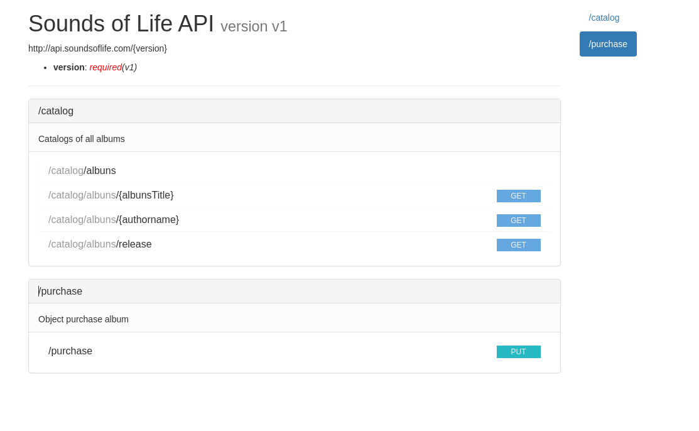
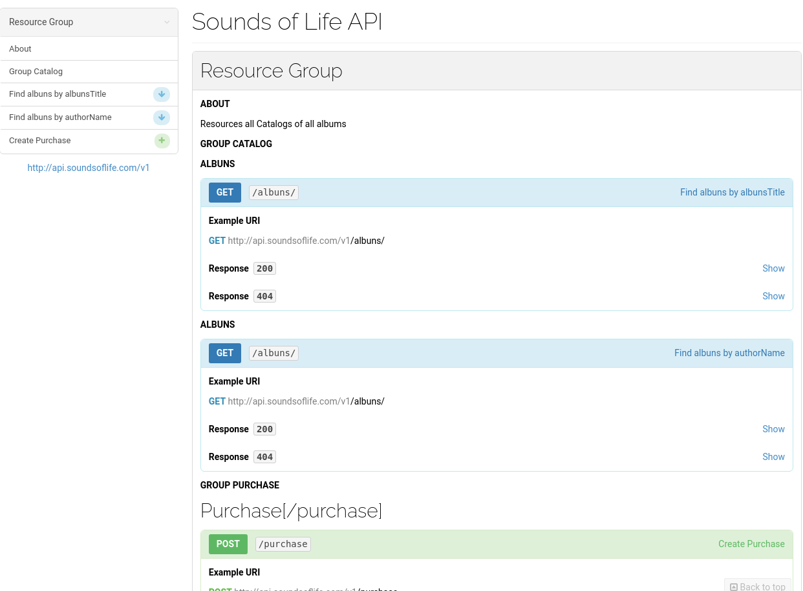

# Documentação API REST

Este conteúdo tem como objetivo explorar as principais ferramentas para documentar API no modelo de arquitetura **REST**.

## Introdução

Antes de explorar as prinicipais ferramentas de mercado usadas para documentar API no modelo de aquitetura **REST**,  vamos falar um pouco melhor sobre o que é uma documentação de API e qual é a sua importância para um projeto.

### O que é ?

Documentação de API é um texto escrito (ou manual de referência) que acompanha uma API. Este conteúdo explica como usar uma API de maneira eficaz. Esta documentação pode ser criada manualmente ou automaticamente usando softwares e ferramentas específicas para este fim.

**Exemplos de documentação**

* [API Spotify](https://developer.spotify.com/console/get-album/)
* [API Stripe](https://stripe.com/docs/api)
* [API Paypal](https://developer.paypal.com/docs/api/overview/)

### Por que documentar uma API é importante ?

A documentação de uma API é a chave para melhorar a experiência de uso de um desenvolvedor nela mesma, o famoso *dev friendly*. Quanto mais completa for sua documentação certificando que ela esteja seguindo as boas práticas estabelecidas no modelo de arquitetura REST, mais os desenvolvedores a acharão agradável de usar, levando a uma maior adoção de seus produtos e serviços. As APIs podem ajudar muito nos esforços de melhorar a transformação digital da maioria das empresas. 

Uma documentação de API clara torna mais fácil para as empresas adotar a sua API. Uma documentação bem explicada economiza tempo e custos de suporte. Com uma boa documentação, uma equipe provavelmente gastará menos tempo integrando novos usuários e respondendo a chamados e e-mails de suporte.

O modelo de documentação de API REST escrito incorretamente implica em usuários mais frustrados e que dependerão de sua equipe para auxiliá-los na integração de sua API, o que aumenta seus custos operacionais

## Principais formas de documentação

Atualmente três especificações se destacam.

* [RAML](https://raml.org/developers/document-your-api)
* [API Blueprint](https://apiblueprint.org/)
* [Swagger](https://swagger.io/resources/open-api/)

Todas as três opções acima tem suporte a estratégia de **API First** e a partir da documentação pronta podem ser criados servidores de *Mocks/Stubs*, testes automatizados e outras diversas opções que podem facilitar muito a vida de quem consome sua API de forma externa ou até mesmo dentro de uma organização estruturada em *backend/frontend*.


## Estudo de caso

Como forma de exemplicar a construção de nossas documentações que serão feitas nos formatos mencionados acima. Vamos descrever aqui um caso de uso que será documentado nos três formatos. 

A empresa  *Sounds of Life Corp*, uma grande empresa multinacional que, de alguma maneira, permanece no mercado apesar de manter o foco totalmente na venda de CDs em pleno século 21. Decide  disponibilizar seus catálogos de maneira online. Para que seus fiéis clientes atravéz de um aplicativo possam vizualiza-los e adiquiri-los.

Para tal como forma de exemplificar a construção de nossa documentação será preciso criar uma API REST que será consumida por este aplicativo.

Esta API REST deverá ter as seguintes funcionalidades:

* Deverá ter um endpoint para consultar um disco baseado no seu título;
* Deverá ter um endpoint para consultar um disco baseado em seu autor;
* Deverá ter um endpoint para consultar uma seleção de discos baseados no ano de lançamento;
* Dererá ter um endpoint para registrar uma compra enviando as informações do disco;

As URIs absolutas dos recursos, mencionaos acima na mesma ordem são os seguintes:

* https://api.soundsoflife.com/v1/catalog;

* https://api.soundsoflife.com/v1/catalog/albuns;

* https://api.soundsoflife.com/v1/catalog/albuns/{albunsTitle};

* https://api.soundsoflife.com/v1/catalog/albuns/{authorName};

* https://api.soundsoflife.com/v1/catalog/albuns/release?stardate=1980&enddate=2021;

* https://api.soundsoflife.com/v1/purchase;


## RAML 

Acrônimo para **RESTful API Modeling Language**. RAML é uma linguagem para descrever explicitamente API **RESTful**. Além de tornar mais fácil o gerenciamento do ciclo de vida da API, o **RAML** é conciso e faz a legibilidade da API mais amigável ao ser humano.

Para documentar uma API com **RAML**, você pode optar por ferramentas open source como o [ API Console](https://github.com/mulesoft/api-console) ou o [RAML 2 HTML](https://github.com/raml2html/raml2html)  ou outras disponíveis na [página de ferramentas](https://raml.org/projects) do projeto.  A documentação pode ser gerada rapidamente, sendo que os analisadores disponíveis em vários idiomas permitem que a criação de documentos personalizados e scripts interativos.

O **RAML** tem como formato base o [YAML](https://pt.wikipedia.org/wiki/YAML), mas também é amplamente desenvolvido com base em outros padrões como [JSON](https://jsonapi.org/) e é neutro com ferramentas de linguagem como Java, Javascript, .Net, PHP, Python, Ruby.

Como exemplos de documentações feitas neste formato temos a páginas do [Spotfy for Developer](https://developer.spotify.com/console/get-album/) e a [e.Pages](https://developer.epages.com/apps/api-reference/resource-carts.html).

### Documentando em RAML

A primeira linha de um documento escrito em **RAML** deve começar com o texto **#% RAML** seguido por um único espaço e logo em seguida pelo texto **1.0** e nada mais  até o final da linha. Os documentos no formato **RAML** iniciam com o comentário da versão RAML e um identificador.

```yaml
#%RAML 1.0
---
title: Sounds of Life API 
baseUri: https://api.soundsoflife.com/{version}
version: v1
description: Resources all Catalogs of all albums
```

| Nome    | Descrição                                                    |
| ------- | ------------------------------------------------------------ |
| title   | Um rótulo curto de texto simples para a API. Seu valor é uma string. |
| baseUri | Uma URI que serve de base para URIs de todos os recursos. Frequentemente usado como base da URL de cada recurso que contém a localização da API. Pode ser uma URI de modelo. |
| version | A versão da API, por exemplo "v1". Seu valor é uma string.   |

Podem ser incluidos também outros tipos de campos,  a especificação disponibiliza uma serie de marcações que pode ser vista de maneira completa [aqui](https://github.com/raml-org/raml-spec/blob/master/versions/raml-10/raml-10.md/#the-root-of-the-document) . 

#### Incluindo os recursos

```yaml
/catalog:
  /albuns:
/purchase:  
```
Todo recurso em **RAML** inicia com uma uma barra (/) é assim que é indicado um novo recurso. Quaisquer métodos e parâmetros aninhados sob esses recursos de nível superior pertencem e atuam sobre esse recurso. Agora, como cada um desses recursos é uma coleção de objetos individuais (authors, albuns), precisaremos definir alguns sub-recursos para preencher a coleção.

```yaml
/catalog:
  /albuns:
    /{albunsTitle}:
    /{authorName}:
    /release:
/purchase:  
```

Recursos aninhados são úteis quando você deseja chamar um subconjunto específico de seu recurso para restringi-lo. 

Portanto, para fazer uma solicitação a esse recurso aninhado, a URI do album do **AC/DC**, **Back in Black**  seria semelhante a *https://api.soundsoflife.com/v1/catalog/albuns/Back-in-Black*. Ou se quisermos consultar todos os albuns da banda **AC/DC **seria semelhante a  *https://api.soundsoflife.com/v1/catalog/authors/AC-DC*

Agora precisamos completar os recursos com suas operações, retornos e descrições:

```yaml
/catalog:
  description: Catalogs of all albums
  /albuns:
    description: Album 
    /{albunsTitle}:
      description: Album title 
      get:
        responses:
          200:
            body: 
              application/json:
              type: Albuns[]
    /{authorName}:
      description: Album author name 
      get:
        responses:
          200:
            body: 
              application/json:
              type: Albuns[]       
    /release:
      description: Date release album
      get:
        queryString: 
           stardate: 
             displayName: Start release date
             type: number
             description: Start range date release
             example: 1980
             required: true
           enddate: 
             displayName: Final release date
             type: number
             description: Final range date release
             example: 2021
             required: true
        responses:
           200:
             body: 
               application/json:
               type: Albuns[]
/purchase:
   description: Object purchase album
   put:
     body:
        application/json:
          type: Purchase
          example: 
            value: 
              iduser:  20 # ID User
              idalbum: 30 # ID Album
types:
  Albuns:
    type: object
    properties:
      id: number
      name: string
      author: string
      releasedate: number
      value: number
  Purchase:
    type: object
    properties:
      iduser: number
      idalbum: number

```

É possivel definir *objetos* e reutiliza-los nos recursos de nossa documentação, como é o caso do nosso exemplo com os objetos *Albuns* e  *Purchase* . Também podemos definir uma descrição para cada recurso juntamente com suas operações **http **. Para mais informações sobre possibilidades e recursos veja a especificação oficial do projeto no [github](https://github.com/raml-org/raml-spec/blob/master/versions/raml-10/raml-10.md/#base-uri-and-base-uri-parameters).

A documentação completa do nosso exemplo pode ser vista [aqui](./aula_1_RAML/api-sample.raml). 

#### Static Page

Após a criação da nossa documentação o próximo passo a compartilhar-la e uma das maneiras que temos disponíveis para isso é tranforma-la em uma página estática.

Para isso vamos ultilizar a ferramenta [RAML2HTML](https://github.com/raml2html/raml2html) . Como premissa é preciso ter o **node js** instalado em seu ambiente local.

##### Install 

Em seu terminal digite a instrução abaixo:
```bash
npm i -g raml2html
```
Após a instalação o próximo passo e entrar no diretorio onde encontra-se o nosso arquivo de documentação e executar a seguinte instrução:

```bash
raml2html api-sample.raml > api-sample.html
```

Observe que foi gerado uma página em html [*api-sample.html*](./aula_1_RAML/api-sample.html), esta página pode ser acessada pelo seu navergador, lá você pode navegar pela sua API de uma forma mais visual. Existem diversos temas que a ferramenta  [RAML2HTML](https://github.com/raml2html/raml2html) disponibiliza. 



Não deixe de verificar o catálogo de [projetos disponíveis](https://raml.org/projects) na página oficial do **RAML** , lá você encontrará uma série de projetos que lhe auxiliaram no seu dia a dia.


## API Blueprint

Foi criado pela empresa [apiary](https://apiary.io/ )  que foi comprada pela oracle. Como o **RAML** trabalha com o formato de **API First** .

A grande vantagem do modelo de **API Blueprint** é ser descrita em [Markdown](https://www.markdownguide.org/), o que facilita bastante a edição dos documentos, mesmo por quem não tem familiaridade com código.

Além disso, existe uma série de ferramentas disponíveis que permitem gerar documentos no padrão Swagger, “mock servers” e testes.

### Documentando em API Blueprint

A definição é escrita em um arquivo no formato [Markdown](https://www.markdownguide.org), que pode ser nomeado como *api.md* ou *api.apib*.

Ambos funcionam, mas se usarmos a extensão *.apib* podemos aproveitar plugins para editores como o *SublimeText* e *Vscode* que auxiliam na escrita da documentação. Os plugins podem ser encontrados no site oficial da especificação.

A primeira etapa  é especificar o nome da API e os seus metadados. Esta etapa tem a seguinte aparência:

```markdown
FORMAT: 1A
HOST: http://api.soundsoflife.com/v1
```

O blueprint começa com uma seção de metadados. Neste caso, especificamos que **FORMAT** tem o valor **1A**.  A palavra-chave *format* denota a versão do API Blueprint.


O primeiro título no blueprint serve como o nome de sua API, que neste caso é *Sounds of Life API*. Os títulos começam com um ou mais símbolos **#** seguidos de um título. O nome da API aqui usa um *hash* para distingui-lo como o primeiro nível. O número de **#** que você usar determinará o nível do título.

```markdown
# Sounds of Life API
## About [/]
Resources all Catalogs of all albums
```

####  Incluindo os recursos

Agora é hora de começar a documentar os recursos da API. Usando a palavra-chave *Group* no início de um título, criamos um grupo de recursos relacionados.

```markdown
# Group Catalog [/catalog]

# Group Purchase [/purchase]
```
Dentro de cada grupo de recursos, podemos definir o restante dos nossos recursos de forma alinhada. 

Assim como o **RAML** é possivel também definir *objetos* e reutiliza-los nos recursos de nossa documentação, como é o caso do nosso exemplo com os objetos *Albuns* e  *Purchase* . Também podemos definir uma descrição para cada recurso juntamente com suas operações **http **. Para mais informações sobre possibilidades e recursos veja a especificação oficial do projeto no [github](https://apiblueprint.org/documentation/tutorial.html).

```markdown
FORMAT: 1A
HOST: http://api.soundsoflife.com/v1

# Sounds of Life API

## About [/]
Resources all Catalogs of all albums

# Group Catalog [/catalog]

## Albuns [/albuns/{albunsTitle}]

### Find albuns by albunsTitle [GET]

+ Response 200 (application/json)
    + Attributes (array[Albuns])

+ Response 404 (application/json)
    + Attributes (Error)

## Albuns [/albuns/{authorName}]

### Find albuns by authorName [GET]

+ Response 200 (application/json)
    + Attributes (array[Albuns])

+ Response 404 (application/json)
    + Attributes (Error)

# Group Purchase [/purchase]

## Purchase[/purchase]

### Create Purchase [POST]

+ Request Criar uma mensagem 
    + Headers
            Accept: application/json
            Content-Type: application/json
    + Attributes (Purchase)

+ Response 201 (application/json)
    + Attributes (Created)
+ Response 400 (application/json)
    + Attributes (Error)

# Data Structures

## Albuns (object)
+ id (string) - Id Album
+ name (string) - Name Album
+ author (string) - Author Albun
+ releasedate (string) - Date release
+ value (string) - Vaue Album

## Purchase (object)
+ iduser (string) - Id user
+ idalbum (string) - Id album
  
## Error (object)
+ code: 400 (number) - Status code
+ message (string) - Mensagem do status
+ description (string) - Descrição do status

## Created (object)
+ id (number) - Id gerado

```

A documentação completa do nosso exemplo pode ser vista [aqui](./aula_2_API_BluePrint/api-sample.apib). 

#### Static Page

Após a criação da nossa documentação o próximo passo a compartilhar-la e uma das maneiras que temos disponíveis para isso é tranforma-la em uma página estática.

Para isso vamos ultilizar a ferramenta [aglio](https://github.com/danielgtaylor/aglio) . Como premissa é preciso ter o **node js** instalado em seu ambiente local.

##### Install 

Em seu terminal digite a instrução abaixo:

```bash
npm install -g aglio
```

Para gerar nossa página estática precisaremos dentro da pasta onde encontra-se a documentação gerada e precisaremos executar o comando:


```bash
aglio -i api-sample.apib --theme-full-width --no-theme-condense -o index-sample.html
```
Uma outra forma muito útil de usar a ferramenta é execuntando atravéz do comando -s  como o exemplo abaixo:

```bash
aglio -i api-sample.apib --theme-full-width --no-theme-condense --no-theme-condense -s
```
Isso gera um servidor local, na porta **3000**, que fica observando alterações no arquivo *.apib* e atualiza automaticamente a página da documentação. Isso facilita bastante a manutenção do documento.





#### Mock Server

Com a API definida as equipes de frontend (web, mobile, etc) e backend (quem vai desenvolver a API) podem trabalhar em paralelo. Para facilitar ainda mais podemos criar um “mock server” que vai gerar dados falsos baseados na definição da API. Assim a equipe de frontend pode trabalhar sem precisar esperar a equipe de backend terminar a implementação. Para isso vamos usar outra ferramenta, a drakov.

Para instalar a ferramenta basta executar:

```bash
npm install -g drakov
```

E para gerar o servidor:

```bash
drakov -f api.apib -p 4000
```

Desta forma temos uma API funcional que pode ser usada para testes e desenvolvimento.


#### Testes

## Swagger

Entre os diversos formatos de descrição de APIs que geram a documentação dinamicamente, o mais conhecido é o Swagger. Ele é de código aberto e permite que desenvolvedores e equipes projetem, construam, documentem e consumam APIs em RESTful. Atualmente se encontra em sua versão 2.0.

Trata-se de uma ferramenta padrão de mercado, cujo objetivo é possibilitar que a documentação evolua juntamente com a implementação da API, uma vez que a documentação pode ser gerada automaticamente. Grandes empresas de tecnologia como Amazon, Netflix, Apigee, Getty Images, Microsoft e Paypal já adotam Swagger em seus produtos e projetos, principalmente em função da facilidade de integração com o código fonte.
Na hora de descrever a API é preciso que os arquivos sejam criados no formato JSON. Se por um lado isso facilita o trabalho de programadores, por outro pode ser algo complexo demais para alguém que não esteja tão envolvido com o código.

O Swagger é capaz de ajudar desenvolvedores de APIs REST a:

* Modelar APIs;
* Gerar documentação automatizada da API;
* Gerar códigos do cliente e do servidor, suportando diversas linguagens de programação;
* Testar funcionalidades da API.

Para realizar tais tarefas o Swagger precisa especificar a OpenAPI, uma linguagem para descrever contratos de APIs REST. Ela delimita um formato JSON com campos padronizados para que o usuário consiga descrever recursos, modelo de dados, URIs, Content-Types e métodos HTTP aceitos .

Além da OpenAPI, o Swagger dispõe um conjunto de ferramentas e as principais são:

* Swagger Editor
* Swagger UI
* Swagger Codegen

O módulo de UI permite que desenvolvedores interajam intuitivamente com as APIs em sandbox. Já o Editor é uma ferramenta online que possibilita documentar de forma mais interativa usando YAML. Um dos benefícios do Editor é seu portfólio contendo templates de documentos que servem de base para quem não deseja iniciar do “zero” a documentação.
Além disso, uma de suas principais funções do Editor é de que ao iniciar um novo projeto o usuário pode definir a toda a estrutura de sua API e assim gerar o código em uma linguagem de sua preferência

Quanto ao Swagger Codegen, a partir da descrição em YAML cria automaticamente o “esqueleto” da API com documentação em diferentes linguagens de programação.

### SpringFox

Em seu projeto no formato springboot ;

#### Adicionando a Dependência Maven

Usaremos a implementação Springfox da especificação Swagger. A versão mais recente pode ser encontrada  no [Maven Central](https://search.maven.org/classic/#search%7Cga%7C1%7C%22Springfox%20Swagger2%22) .

Para adicioná-lo ao nosso projeto Maven, precisamos de uma dependência no arquivo pom.xml :

```xml
<dependency>
    <groupId>io.springfox</groupId>
    <artifactId>springfox-swagger2</artifactId>
    <version>3.0.0</version>
</dependency>
```

Para os projetos baseados em Spring Boot, **é suficiente adicionar uma única dependência \*springfox-boot-starter\*** :

```xml
<dependency>
    <groupId>io.springfox</groupId>
    <artifactId>springfox-boot-starter</artifactId>
    <version>3.0.0</version>
</dependency>
```

#### Integrando Swagger 2 ao projeto

A configuração do Swagger gira principalmente em torno do bean Docket :

```java
@Configuration
public class SpringFoxConfig {                                    
    @Bean
    public Docket api() { 
        return new Docket(DocumentationType.SWAGGER_2)  
          .select()                                  
          .apis(RequestHandlerSelectors.any())              
          .paths(PathSelectors.any())                          
          .build();                                           
    }
}
```

Depois de definir o bean Docket , seu método select () retorna uma instância de ApiSelectorBuilder , que fornece uma maneira de controlar os endpoints expostos pelo Swagger.

Podemos configurar predicados para selecionar RequestHandler s com a ajuda de RequestHandlerSelectors e PathSelectors . Usar any () para ambos tornará a documentação de toda a nossa API disponível por meio do Swagger.

#### Verificação

Para verificar se o Springfox está funcionando, podemos visitar este URL em nosso navegador:

http://localhost:8080 /contexto-seu-projeto /api/ v2/api-docs

O resultado é uma resposta JSON com um grande número de pares de valores-chave, que não é muito legível por humanos. Felizmente, o Swagger fornece a IU Swagger para essa finalidade.

#### Swagger UI

A IU do Swagger é uma solução integrada que torna a interação do usuário com a documentação da API gerada pelo Swagger muito mais fácil.

Para usar a IU Swagger, precisamos adicionar uma dependência adicional do Maven:

```xml
<dependency>
    <groupId>io.springfox</groupId>
    <artifactId>springfox-swagger-ui</artifactId>
    <version>2.9.2</version>
</dependency>
```

Agora podemos testá-lo em nosso navegador visitando:

http://localhost:8080 /contexto-seu-projeto /swagger-ui/